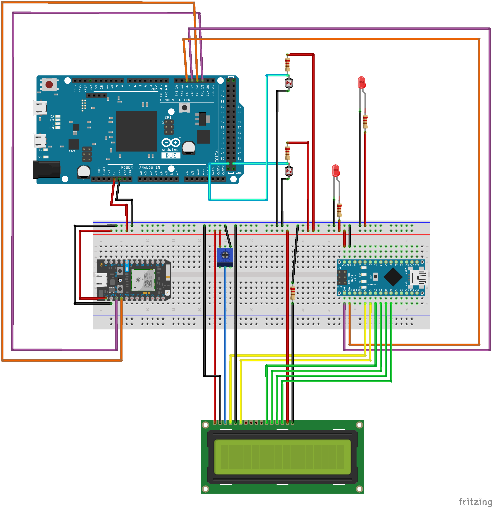

# SocCar Project

## Arena

### API Connection

The API Connection folder contains all of the source code for the connection between the backend and the Arena. If you're interested, there are some functional unit tests in there under the [src](https://github.com/gmarino2048/Real-Life-Rocket-League/tree/master/Hardware/Arena/API%20Connection/API%20Connection/src) folder.

If you are unsure of the login credentials for the project, please see the `ID and Secret.txt` file included

### Arena Hardware

#### Microcontroller Programming

To program each of the microcontrollers, navigate to the Arduino folder. There should be three microcontrollers total: an Arduino Due, a Particle Photon, and an Arduino nano. The following list gives the steps to program each microcontroller successfully.

- Arduino Due -- has the most pins, ARM Processor, is the largest device of the three
  - Using the arduino application, load the Arena-Controller.ino sketch onto this device
  - Reset the Controller

- Particle Photon -- has the least pins, is the smallest device, has a blinking RGB LED
  - Go to build.particle.io
  - Log in and register the device to your account (follow the prompted steps)
  - Copy and paste the Web-Connection.ino file into the code window
  - Click "Flash", and wait for the device to update

- Arduino Nano -- small, but has more pins than the Photon, has  green and yellow LEDs which blink occasionally
  - Using the arduino application, load the LCD-Controller.ino sketch onto the device.
  - Occasionally, the bootloader of the device will be erased to fit the entire volume of the sketch into memory. If this occurs and you cannot load the code, see [this example.](https://www.arduino.cc/en/Tutorial/ArduinoISP)
  - Once the code has been uploaded, see the guide below for connecting each of the components.

#### Microcontroller Connection

Using the above information, connect each individual component according to the diagram found below:

Note that the LCD Display is connected to the Arduino Nano, and the break beam sensors (modeled by a resistor and photoresistor in this case) are connected to the DUE.

Ensure that ALL of the connections are correct before supplying power to the devices, as incorrect connections could potentially damage certain components.

If you have any problems connecting the components, feel free to [open an issue](https://github.com/gmarino2048/Real-Life-Rocket-League/issues) on our github repository or [send one of us an email](gxm262@case.edu) for more help with the problem.

We hope you enjoy playing the game as much as we've enjoyed creating it :)
